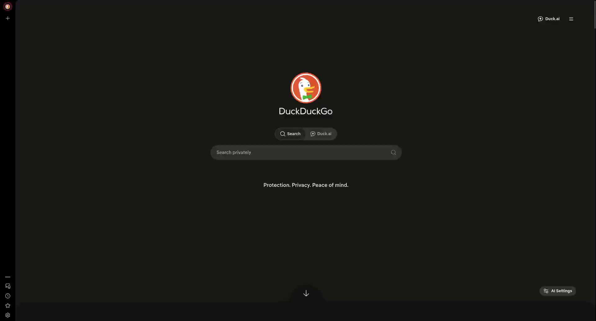
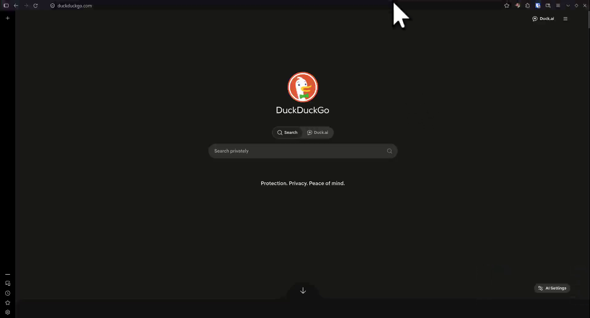

# firefox-ui-autohide

Auto-hide for Firefox's top toolbars, like Vivaldi's **UI Auto-hide**: the address bar (and tab/bookmarks toolbars) disappear until you move the pointer to the top edge of the window, then slide over the page without resizing it. Built for people who use **vertical tabs** and want every pixel for the page.


| Hidden (full page) | Pointer at top edge |
|---|---|
|  |  |

*Tested on Firefox 157, Linux (Flatpak), vertical tabs enabled. Other platforms/versions: untested.*

## Install (any Firefox release): userChrome.css

```bash
./install.sh            # finds your profile (native, Flatpak, Snap), enables the pref, copies the CSS
./install.sh --uninstall
```

Or manually:
1. `about:config` → `toolkit.legacyUserProfileCustomizations.stylesheets` = `true`
2. `about:support` → *Profile Folder* → create `chrome/` and copy `css/userChrome.css` into it
3. Restart Firefox

Customize by editing the CSS: background color (`background-color`), hide delay (`transition-delay`), trigger strip height (`max-height: 6px`).

## Extension (Developer Edition / Nightly only)

`extension/` is a WebExtension with an options page (solid/blur background, color, opacity, delay, strip height, per-toolbar choice, `Ctrl+Alt+H` toggle). It uses a `chromeCSS` **Experiment API** to inject the stylesheet at runtime, so it **cannot be published on addons.mozilla.org** and does not load on release Firefox ("Using 'experiment_apis' requires a privileged add-on").
Load via `about:debugging` → *Load Temporary Add-on* → `extension/manifest.json`.

## Limitations
- Selectors (`#navigator-toolbox`, ...) are Firefox internals and may change between versions.
- Only the top toolbars are handled; the sidebar/vertical tabs are intentionally left untouched.
- Vivaldi's status bar has no Firefox equivalent.

See [PROPOSAL.md](PROPOSAL.md) for the case for a built-in option, and **[vote for it on Mozilla Connect](https://connect.mozilla.org/t5/ideas/built-in-quot-auto-hide-toolbars-quot-option-like-vivaldi-s-ui/idi-p/141628)**.

---

# firefox-ui-autohide (Português)

Auto-hide das barras superiores do Firefox, como o **UI Auto-hide** do Vivaldi: a barra de endereço (e as de abas/favoritos) somem até você encostar o mouse na borda de cima da janela, e aparecem por cima da página, sem redimensioná-la. Feito para quem usa **abas verticais** e quer o máximo de espaço para a página.

## Instalação (Firefox release): userChrome.css
```bash
./install.sh            # acha o perfil (nativo, Flatpak, Snap), ativa a preferência e copia o CSS
./install.sh --uninstall
```
Manual: ative `toolkit.legacyUserProfileCustomizations.stylesheets` em `about:config`, copie `css/userChrome.css` para `<pasta do perfil>/chrome/` (veja `about:support`) e reinicie.

## Extensão (só Developer Edition / Nightly)
A pasta `extension/` tem a versão com tela de opções. Ela usa uma Experiment API, então **não pode ser publicada no addons.mozilla.org** nem carrega no Firefox release.
